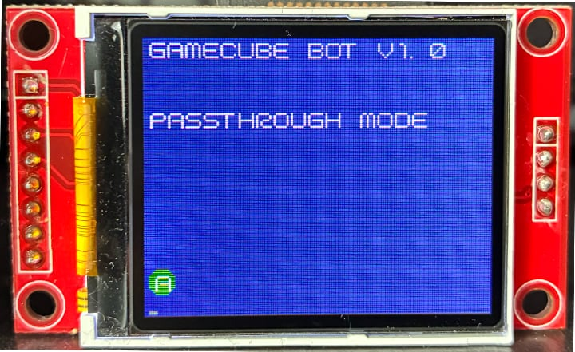
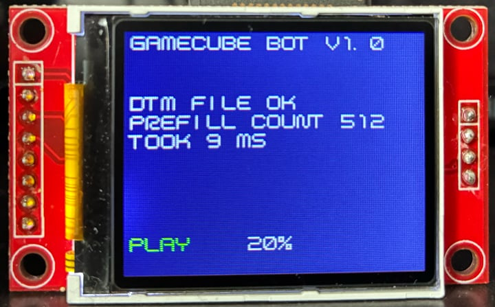
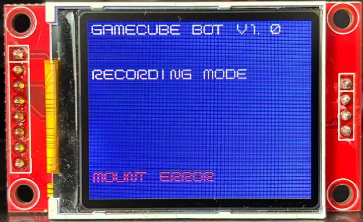

# gcbot or GameCube bot

Record and play DTM files on a GameCube.

Operates in three modes:
1. **Passthrough**: passes inputs from the controller to the GameCube and shows digital buttons on the screen when pressed. Great for checking if all the wires are properly connected. Also shows a blinking square at the bottom left corner, so you know it's running.
2. **DTM_Playback**: reads a file named `REC.DTM` from the SD card and replays inputs to the GameCube. The display shows how many inputs have been sent to the GameCube as a percentage.
3. **DTM_Recording**: passes inputs from the controller to the GameCube and records them to a file named `REC.DTM` on the SD card. The file is always overwritten when powering the Pico, so be careful! Pressing `Start + Z + Y` finishes the recording, `Start + Z + B` pauses the recording and `Start + Z + A` resumes recording.

<br/>


**Passthrough** mode with A button pressed.



**DTM_Playback** mode with 20% of inputs sent.



**DTM_Recording** mode with no SD card inserted.

You can check out a video of how **DTM_Recording** and **DTM_Playback** modes run [here](https://youtu.be/JH5Yr9tbgrY) with a [Dolphin Emulator]((https://dolphin-emu.org)) run included for comparison. The `REC.DTM` file for these recordings is included in this repository. The header has been edited, so it can be run on Dolphin (see FAQ below). You'll need the PAL version of Metal Gear Solid: The Twin Snakes to try it out.

## Hardware

1. **Raspberry Pi Pico**. The `PICO_BOARD` variable in `CMakeLists.txt` is set to `pico2`, but you can change that to whatever board you're using.
2. **GameCube extension cable**. Split it in half and solder proper connectors to the wires so you can hook them up to the Pico.
3. **ST7735 display with an SD card slot**. Mine's red with a green tab on the sticker on the screen. I had some trouble identifying what init sequence to use, but the one used by gcbot is supposed to be generic.
4. **SDHC card** formatted as `FAT32`. MMC or SDSC will not work. Don't keep important files on this card!
5. **A three-way toggle switch** is optional, but makes switching modes a lot faster.

## Wiring

gcbot is powered by the GameCube `3V3` line, but you could also use the `5V` line connected to `VBUS`, since controller rumble is disabled.


### Mode Selection Wiring

A three-way toggle switch works best, but you can also just connect a jump wire from GPIO6/7/8 to GND. The GPIO pins have pull-ups enabled. If nothing is connected, gcbot will default to **Passthrough** mode.

```
GPIO6 / Passthrough   -> switch pin 1 in
GPIO7 / DTM_Playback  -> switch pin 2 in
GPIO8 / DTM_Recording -> switch pin 3 in
```
```
switch pin 1 out -> GND
switch pin 2 out -> GND
switch pin 3 out -> GND
```

### Optional Wiring

You can measure the execution times of `console.WaitForPoll()` on `GPIO28` and `console.SendReport()` on `GPIO27` with a logic analyzer in **Passthrough** mode. Remember to hook up the logic analyzer ground to a `GND` pin on the Pico.


PulseView showing `WaitForPoll` and `SendReport` timings and GameCube and controller Joybus traffic.

## Submodules

[joybus-pio](https://github.com/JonnyHaystack/joybus-pio/) for Joybus (the controller protocol) I/O.

[no-OS-FatFS-SD-SDIO-SPI-RPi-Pico](https://github.com/carlk3/no-OS-FatFS-SD-SDIO-SPI-RPi-Pico/) for SD card I/O.

## FAQ

**Q: Can it do TAS runs?**  
A: I doubt it. AFAIK a badly timed seek on the optical drive can cause a run to desync which makes frame perfect inputs impossible. Maybe running games from a solid state drive on a modded GameCube might work better. Same desync problem applies to normal runs as well.

**Q: Can I run the `REC.DTM` file on Dolphin?**  
A: Yes, but you need to add the **Game ID** (at `0x04`, six bytes), **VI count** (at `0x0D`, eight bytes) and **tick count** (at `0xED`, eight bytes) to the file header. gcbot can't track VI  or tick count, so you could multiply the **input count** (at `0x15`, eight bytes) with 60 for VI count and 10M for tick count, I guess.

**Q: Can I run DTM files recorded on Dolphin?**  
A: Yes, just rename the file to `REC.DTM` before transfering it to your SD card. Remember to run files that are recorded at the same frequency (50 or 60 Hz) that the game runs on! No guarantees on the accuracy.

**Q: Something went wrong and my computer doesn't recognize my SD card! Any advice?**  
A: Use **SD Memory Card Formatter** ([Windows/macOS](https://www.sdcard.org/downloads/formatter/) and [Linux](https://www.sdcard.org/downloads/sd-memory-card-formatter-for-linux/)) with the `--discard` switch.
